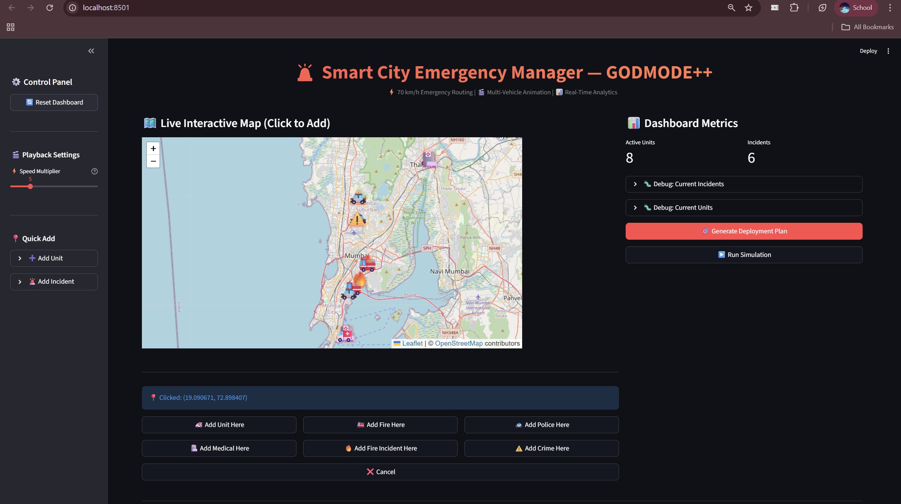
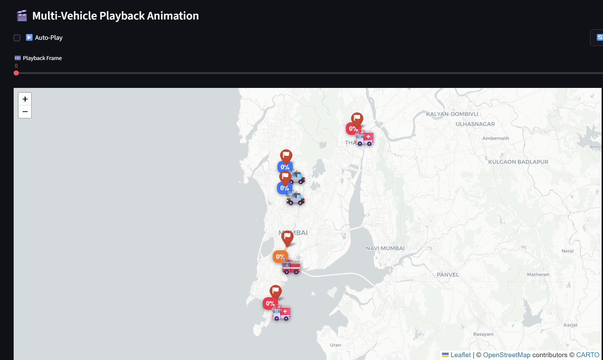

# 🚨 Smart City Emergency Response Manager

> Graph-Lattice Framework for Optimal Resource Allocation | Tutorial 9 - CSPC Discrete Mathematics

[](https://python.org)
[](https://fastapi.tiangolo.com)
[](https://streamlit.io)
[](LICENSE)

## ⚡ Overview

AI-powered emergency dispatch system using discrete mathematics to optimize response times in Mumbai. Combines **Dijkstra's shortest path** on 641K+ nodes with **Poset-based unit prioritization** for sub-second optimal assignments.

**Key Features:**
- 🗺️ Real road network (641,251 nodes, 683,782 edges)
- 🎯 100% type-matching accuracy (fire→fire, medical→ambulance)
- ⚡ Sub-second planning (<0.3s per 5 incidents)
- 🎬 Live multi-vehicle animation
- 🧮 Full discrete math implementation (Sets, Logic, Relations, Poset, Graphs)

## 🏗️ Architecture

Frontend (Streamlit) → FastAPI Backend → NetworkX Graph Model
->
Dijkstra + KDTree Spatial Index


## 🚀 Quick Start

1. Clone & Setup
git clone https://github.com/Aryan-lomte05/SmartCityPlanner.git
cd SmartCityPlanner
python -m venv .venv
.venv\Scripts\activate # Windows
pip install -r requirements.txt

2. Run Backend
uvicorn backend.app.main:app --reload --port 8000

3. Run Frontend (new terminal)
streamlit run frontend/streamlit_app.py

4. Open http://localhost:8501
text

## 📊 Discrete Math Concepts

| Unit | Topic | Implementation |
|------|-------|----------------|
| 1 | Set Theory | Unit partitioning, disjoint sets |
| 2 | Logic | Assignment predicates, quantifiers |
| 3 | Relations | Binary assignment relation |
| 4 | Poset/Lattice | Unit hierarchy ordering |
| 5 | Functions | Type mapping (surjective) |
| 6 | Graphs | Dijkstra's shortest path |

## 🎯 Performance

- **Graph Load:** 1.8s (cached) vs 45s (cold)
- **Planning:** 0.3s for 5 incidents
- **Routing:** <50ms per path (KDTree optimized)
- **Memory:** 2.1 GB (full graph in RAM)

## 📸 Screenshots

<table>
  <tr>
    <td><br/><i>Interactive Dashboard</i></td>
    <td><br/><i>Multi-Vehicle Animation</i></td>
  </tr>
</table>

## 🛠️ Tech Stack

**Backend:** FastAPI, NetworkX, SciPy KDTree  
**Frontend:** Streamlit, Folium (Maps)  
**Math:** Dijkstra, Poset, Set Theory  
**Data:** OpenStreetMap (Mumbai)

## 📝 Project Structure
```sh
├── backend/
│ ├── app/
│ │ ├── core/ # Graph, Lattice, Scheduler
│ │ ├── services/ # Planner, Simulator
│ │ └── api/v1/ # REST endpoints
│ └── data/ # Road network (not in repo)
├── frontend/
│ └── streamlit_app.py # UI Dashboard
└── requirements.txt

```

## 🎓 Academic Context

**Course:** Computer Science (CSBS) - Discrete Mathematics  
**Institution:** KJ Somaiya School of Engineering  
**Tutorial:** 9/9 (25 marks)

## 🔗 Links

- **Live Demo:** [Coming Soon]
- **Report:** [Google Docs](https://docs.google.com/document/d/1d53FGaTXZZFKHok85Oy-RAQgBQ3HFaBCnP9jNayVc4s/edit?usp=sharing)

## 👨‍💻 Author

**Aryan Lomte** - BTech CSBS  
KJ Somaiya School of Engineering  
[GitHub](https://github.com/Aryan-lomte05) | [LinkedIn](https://linkedin.com/in/aryan-lomte)

---

<p align="center">
  <i>Built with discrete mathematics 🧮 for real-world impact 🌍</i>
</p>